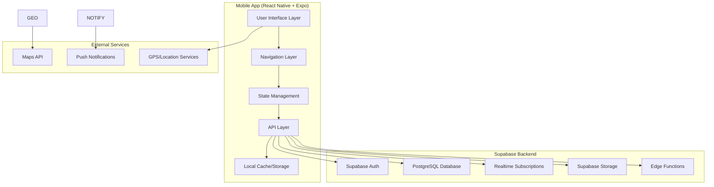

# Design Document

## Overview

The CNMI Transit App is built as a React Native application using Expo, leveraging modern mobile development patterns and CNMI-specific design elements. The app serves three distinct user types (passengers, taxi drivers, transit drivers) through role-based interfaces while maintaining a cohesive island-themed aesthetic.

The architecture emphasizes real-time data synchronization, offline-first functionality, and accessibility compliance, all wrapped in a culturally authentic CNMI visual identity featuring ocean/reef color palettes and latte-stone iconography.

## Architecture

### High-Level Architecture



### Technology Stack

- **Frontend Framework**: React Native with Expo SDK 53
- **Backend**: Supabase (PostgreSQL, Auth, Realtime, Storage, Edge Functions)
- **Navigation**: Expo Router with React Navigation
- **Styling**: NativeWind (Tailwind CSS for React Native) + GluestackUI
- **State Management**: React Context + useReducer with Supabase client
- **Real-time Communication**: Supabase Realtime subscriptions
- **Authentication**: Supabase Auth with role-based access
- **Database**: Supabase PostgreSQL with Row Level Security
- **Local Storage**: Expo SecureStore for sensitive data, AsyncStorage for app data
- **Maps**: React Native Maps with standard interface
- **Offline Support**: Supabase offline-first patterns with local caching
- **Accessibility**: React Native Accessibility APIs

## Components and Interfaces

### Core Component Structure

```
components/
├── ui/                     # Base UI components (GluestackUI)
├── common/                 # Shared components
│   ├── CNMIButton.tsx     # CNMI-themed button component
│   ├── CNMICard.tsx       # Latte-stone styled card component
│   ├── CNMIMap.tsx        # Custom map with CNMI styling
│   ├── LoadingSpinner.tsx # Ocean-themed loading indicator
│   └── AccessibleText.tsx # Accessibility-enhanced text
├── auth/                  # Authentication components
│   ├── LoginScreen.tsx
│   ├── SignupScreen.tsx
│   └── RoleSelector.tsx
├── passenger/             # Passenger-specific components
│   ├── BusTracker.tsx
│   ├── CheckInButton.tsx
│   ├── RouteSelector.tsx
│   ├── TaxiRequest.tsx
│   └── VisitorGuide.tsx
├── driver/                # Driver-specific components
│   ├── DriverDashboard.tsx
│   ├── PassengerAlerts.tsx
│   ├── RouteManager.tsx
│   └── StatusToggle.tsx
└── shared/                # Cross-role components
    ├── NotificationCenter.tsx
    ├── SettingsPanel.tsx
    └── HelpCenter.tsx
```

### Screen Architecture

```
app/
├── (auth)/               # Authentication flow
│   ├── login.tsx
│   ├── signup.tsx
│   └── role-selection.tsx
├── (passenger)/          # Passenger interface
│   ├── _layout.tsx      # Passenger tab navigation
│   ├── map.tsx          # Main map view
│   ├── routes.tsx       # Route browser
│   ├── taxi.tsx         # Taxi services
│   └── guide.tsx        # Visitor guide
├── (driver)/             # Driver interface
│   ├── _layout.tsx      # Driver navigation
│   ├── dashboard.tsx    # Driver dashboard
│   ├── routes.tsx       # Route management
│   └── passengers.tsx   # Passenger management
└── (shared)/             # Shared screens
    ├── settings.tsx
    ├── help.tsx
    └── notifications.tsx
```

### API Interface Design

```typescript
// Core API interfaces
interface User {
  id: string;
  email: string;
  role: 'passenger' | 'taxi_driver' | 'transit_driver';
  profile: UserProfile;
  preferences: UserPreferences;
}

interface BusLocation {
  busId: string;
  routeId: string;
  latitude: number;
  longitude: number;
  heading: number;
  speed: number;
  timestamp: Date;
  nextStopId: string;
  estimatedArrival: Date;
}

interface CheckIn {
  id: string;
  passengerId: string;
  stopId: string;
  busId: string;
  timestamp: Date;
  status: 'pending' | 'confirmed' | 'cancelled';
}

interface TaxiRequest {
  id: string;
  passengerId: string;
  pickupLocation: Location;
  destination?: Location;
  status: 'requested' | 'assigned' | 'en_route' | 'arrived' | 'completed';
  driverId?: string;
  estimatedArrival?: Date;
}
```

## Data Models

### User Management

```typescript
interface UserProfile {
  firstName: string;
  lastName: string;
  phone?: string;
  avatar?: string;
  isVisitor: boolean;
  accessibilityNeeds?: AccessibilityPreferences;
  language: 'en' | 'ch' | 'ko'; // English, Chamorro, Korean
}

interface AccessibilityPreferences {
  screenReader: boolean;
  highContrast: boolean;
  largeText: boolean;
  voiceAnnouncements: boolean;
  vibrationAlerts: boolean;
}
```

### Transit System Models

```typescript
interface Route {
  id: string;
  name: string;
  description: string;
  color: string;
  stops: BusStop[];
  schedule: RouteSchedule[];
  isActive: boolean;
}

interface BusStop {
  id: string;
  name: string;
  description: string;
  latitude: number;
  longitude: number;
  amenities: string[];
  accessibility: AccessibilityFeatures;
  nearbyAttractions?: PointOfInterest[];
}

interface PointOfInterest {
  id: string;
  name: string;
  description: string;
  category: 'attraction' | 'restaurant' | 'shopping' | 'cultural';
  latitude: number;
  longitude: number;
  visitorInfo?: string;
}
```

### Real-time Data Models

```typescript
interface LiveUpdate {
  type: 'bus_location' | 'check_in' | 'taxi_status' | 'route_alert';
  data: any;
  timestamp: Date;
  userId?: string;
}

interface RouteAlert {
  id: string;
  routeId: string;
  type: 'delay' | 'cancellation' | 'detour' | 'service_change';
  message: string;
  severity: 'low' | 'medium' | 'high';
  startTime: Date;
  endTime?: Date;
}
```

## Error Handling

### Error Categories and Responses

1. **Network Errors**
   - Graceful degradation to cached data
   - Clear offline indicators
   - Retry mechanisms with exponential backoff
   - Queue actions for when connectivity returns

2. **Location Errors**
   - Fallback to manual location selection
   - Clear permission request flows
   - Alternative input methods for accessibility

3. **Authentication Errors**
   - Secure token refresh flows
   - Clear re-authentication prompts
   - Maintain user session state

4. **Real-time Data Errors**
   - Fallback to scheduled data with timestamps
   - Clear indicators of data freshness
   - Graceful handling of WebSocket disconnections

### Error UI Components

```typescript
interface ErrorBoundaryProps {
  fallback: React.ComponentType<{error: Error; retry: () => void}>;
  onError?: (error: Error) => void;
}

interface NetworkErrorProps {
  isOffline: boolean;
  lastSync: Date;
  onRetry: () => void;
}
```

## Testing Strategy

### Unit Testing
- **Components**: Jest + React Native Testing Library
- **Utilities**: Jest for pure functions and helpers
- **API Layer**: Mock API responses and error conditions
- **State Management**: Test reducers and context providers

### Integration Testing
- **Navigation Flows**: Test complete user journeys
- **API Integration**: Test real API calls in development environment
- **Offline Scenarios**: Test offline/online transitions
- **Real-time Features**: Test WebSocket connections and updates

### Accessibility Testing
- **Screen Reader**: Test with TalkBack (Android) and VoiceOver (iOS)
- **Keyboard Navigation**: Ensure full keyboard accessibility
- **Color Contrast**: Automated testing for WCAG compliance
- **Touch Targets**: Verify minimum touch target sizes

### Performance Testing
- **Bundle Size**: Monitor and optimize app bundle size
- **Memory Usage**: Profile memory usage during real-time updates
- **Battery Impact**: Test location and real-time features impact
- **Startup Time**: Optimize cold start performance

### Device Testing
- **Cross-platform**: iOS and Android testing
- **Screen Sizes**: Test on various device sizes
- **OS Versions**: Test on supported OS versions
- **Network Conditions**: Test on various network speeds

## CNMI Design System

### Color Palette (Ocean/Reef Theme)

```typescript
const CNMIColors = {
  // Primary Ocean Blues
  ocean: {
    50: '#E6F3FF',   // Shallow lagoon
    100: '#CCE7FF',  // Coral reef water
    200: '#99CFFF',  // Tropical blue
    300: '#66B7FF',  // Deep lagoon
    400: '#339FFF',  // Ocean blue
    500: '#0087FF',  // Primary ocean
    600: '#006FCC',  // Deep ocean
    700: '#005799',  // Mariana blue
    800: '#003F66',  // Deep sea
    900: '#002733',  // Abyss
  },
  
  // Coral/Reef Accents
  coral: {
    50: '#FFF5F5',   // Soft coral
    100: '#FFE5E5',  // Light coral
    200: '#FFCCCC',  // Coral pink
    300: '#FF9999',  // Bright coral
    400: '#FF6666',  // Vibrant coral
    500: '#FF3333',  // Primary coral
    600: '#E60000',  // Deep coral
    700: '#B30000',  // Dark coral
    800: '#800000',  // Maroon coral
    900: '#4D0000',  // Deep red
  },
  
  // Latte Stone Neutrals
  latte: {
    50: '#FAFAFA',   // White stone
    100: '#F5F5F5',  // Light stone
    200: '#E5E5E5',  // Pale stone
    300: '#D4D4D4',  // Medium stone
    400: '#A3A3A3',  // Gray stone
    500: '#737373',  // Dark stone
    600: '#525252',  // Charcoal stone
    700: '#404040',  // Black stone
    800: '#262626',  // Deep stone
    900: '#171717',  // Obsidian
  }
};
```

### Typography

```typescript
const CNMITypography = {
  fonts: {
    heading: 'Inter-Bold',      // Clean, modern headings
    body: 'Inter-Regular',      // Readable body text
    accent: 'Poppins-Medium',   // For special elements
  },
  
  sizes: {
    xs: 12,
    sm: 14,
    base: 16,
    lg: 18,
    xl: 20,
    '2xl': 24,
    '3xl': 30,
    '4xl': 36,
  }
};
```

### Iconography

- **Latte Stone Elements**: Incorporate traditional latte stone shapes in UI elements
- **Ocean Motifs**: Wave patterns, coral shapes for decorative elements
- **Cultural Symbols**: Respectful use of CNMI cultural symbols
- **Transportation Icons**: Custom bus, taxi, and navigation icons with island flair

### Component Styling

```typescript
const CNMIComponents = {
  button: {
    primary: 'bg-ocean-500 rounded-lg shadow-soft-2',
    secondary: 'bg-coral-100 border-coral-300 rounded-lg',
    ghost: 'bg-transparent border-latte-300 rounded-lg',
  },
  
  card: {
    default: 'bg-white rounded-xl shadow-soft-1 border-latte-100',
    elevated: 'bg-white rounded-xl shadow-soft-3 border-latte-200',
  },
  
  input: {
    default: 'bg-latte-50 border-latte-300 rounded-lg',
    focused: 'bg-white border-ocean-400 rounded-lg shadow-soft-1',
  }
};
```

This design provides a comprehensive foundation for implementing the CNMI Transit App with proper architecture, cultural authenticity, and technical robustness while maintaining accessibility and performance standards.